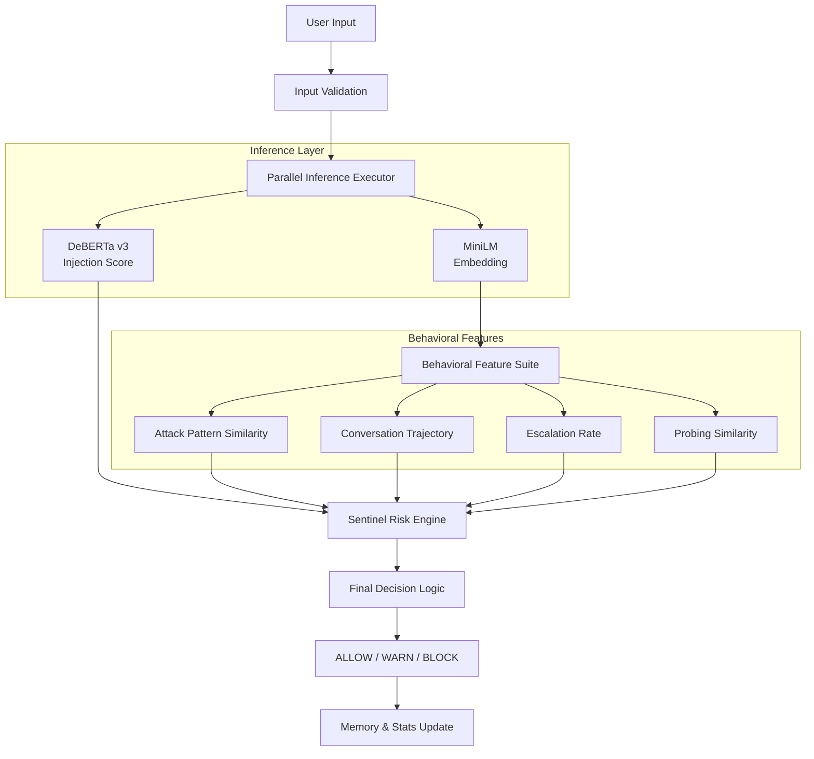

# backend/research/

This folder contains all research, evaluation, and ablation scripts.
It is isolated from the main backend application code.

## Files

| File | Purpose |
|---|---|
| `cached_attack_embeddings.npy` | Pre-computed MiniLM embeddings for attack patterns (auto-generated) |
| `build_dataset.py` | Downloads + builds labeled test dataset |
| `test_dataset.json` | 200+ labeled injection/benign examples |
| `evaluate.py` | Runs full evaluation: Precision, Recall, F1, AUC, confusion matrix |
| `ablation.py` | Ablation study across all features + weight methods |
| `eval_results.json` | Output of evaluate.py |
| `ablation_results.json` | Output of ablation.py |

## Architecture Diagram

## Notes

- If you change `attack_patterns.py`, delete `cached_attack_embeddings.npy` so it regenerates.
- All scripts are designed to be run from the `backend/` directory.
- Do NOT mix these scripts with the main application code in `backend/`.
